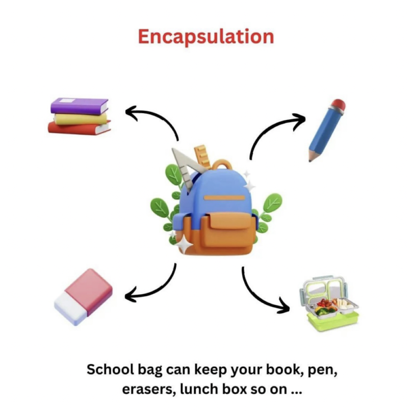
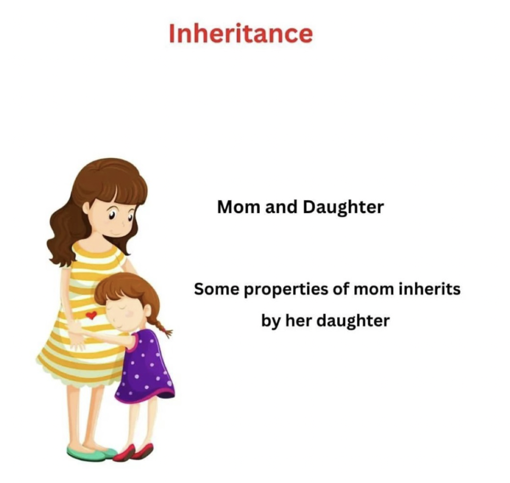
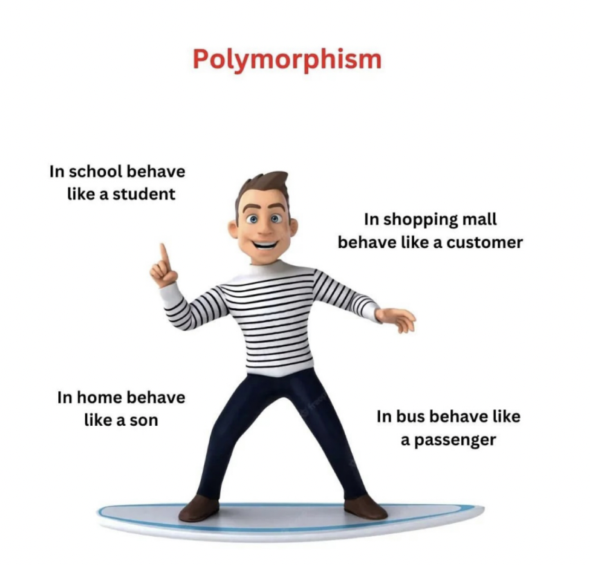
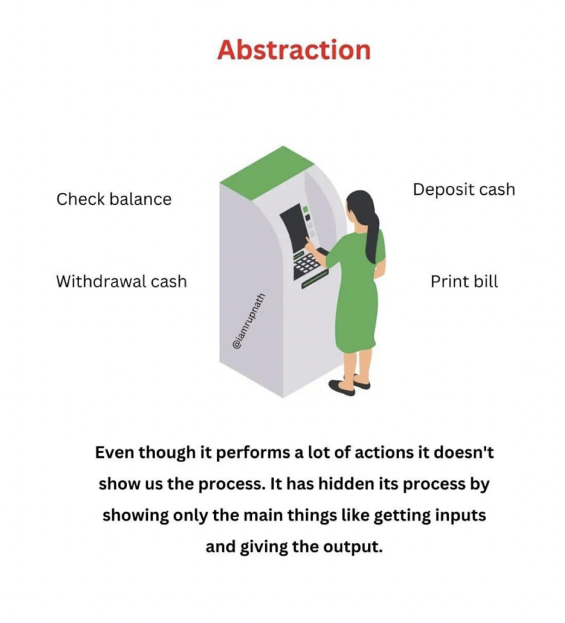

# Object Oriented Programming Notes - Last Minute Revision ✅

Here are **last-minute revision notes** of Object-Oriented Programming in **Java**.
These questions will familiarize you with the most important OOPs concepts and help you **ace job interviews** 🙌

---

## 📌 What is Object-Oriented Programming?

OOP is a programming paradigm built on the concept of **objects**.
Objects combine **data (fields)** and **behavior (methods)**, making code **modular, reusable, and secure**.

---

## 🏛 The Four Pillars of OOP


1. **Encapsulation** → Binding data & methods together
2. **Inheritance** → Acquiring properties of another class
3. **Polymorphism** → Many forms (compile-time & runtime)
4. **Abstraction** → Hiding implementation, showing only essentials

---

## 🔹 Class and Object (Java Example)

```java
class Person {
    String name;

    void printName() {
        System.out.println("Person name is: " + name);
    }
}

public class Main {
    public static void main(String[] args) {
        Person obj1 = new Person();
        obj1.name = "Thanos";
        obj1.printName();
    }
}
```

**Output**

```
Person name is: Thanos
```

---

## 🔹 Constructor in Java

```java
class Student {
    String name;
    int age;
    boolean gender;

    Student() {
        System.out.println("Default Constructor");
    }

    Student(String s, int a, boolean g) {
        name = s;
        age = a;
        gender = g;
        System.out.println("Parameterized Constructor");
    }

    Student(Student s) {
        name = s.name;
        age = s.age;
        gender = s.gender;
        System.out.println("Copy Constructor");
    }

    void printInfo() {
        System.out.println("Name = " + name);
        System.out.println("Age = " + age);
        System.out.println("Gender = " + gender);
        System.out.println();
    }
}

public class Main {
    public static void main(String[] args) {
        Student s1 = new Student();
        Student s2 = new Student("Sumeet", 20, true);
        Student s3 = new Student(s2);

        s1.printInfo();
        s2.printInfo();
        s3.printInfo();
    }
}
```

---

## 🔹 Encapsulation Example

```java
class BankAccount {
    private double balance;  // private data

    public void deposit(double amount) {
        balance += amount;
    }

    public void withdraw(double amount) {
        if (amount <= balance) balance -= amount;
        else System.out.println("Insufficient funds!");
    }

    public double getBalance() {
        return balance;
    }
}

public class Main {
    public static void main(String[] args) {
        BankAccount acc = new BankAccount();
        acc.deposit(5000);
        acc.withdraw(2000);
        System.out.println("Balance = " + acc.getBalance());
    }
}
```



---

## 🔹 Inheritance Example

```java
class Vehicle {
    void fuel() {
        System.out.println("Vehicle needs fuel");
    }
}

class Car extends Vehicle {
    void wheels() {
        System.out.println("Car has 4 wheels");
    }
}

public class Main {
    public static void main(String[] args) {
        Car c = new Car();
        c.fuel();
        c.wheels();
    }
}
```



---

## 🔹 Polymorphism Example

```java
class Shape {
    void draw() {
        System.out.println("Drawing Shape");
    }
}

class Circle extends Shape {
    @Override
    void draw() {
        System.out.println("Drawing Circle");
    }
}

class Square extends Shape {
    @Override
    void draw() {
        System.out.println("Drawing Square");
    }
}

public class Main {
    public static void main(String[] args) {
        Shape s;

        s = new Circle();
        s.draw();

        s = new Square();
        s.draw();
    }
}
```

**Output**

```
Drawing Circle
Drawing Square
```



---

## 🔹 Abstraction Example

```java
abstract class Employee {
    String name;
    Employee(String n) { name = n; }
    abstract void work();   // abstract method
}

class Developer extends Employee {
    Developer(String n) { super(n); }
    void work() {
        System.out.println(name + " is writing code");
    }
}

class Manager extends Employee {
    Manager(String n) { super(n); }
    void work() {
        System.out.println(name + " is managing team");
    }
}

public class Main {
    public static void main(String[] args) {
        Employee e1 = new Developer("Alice");
        Employee e2 = new Manager("Bob");

        e1.work();
        e2.work();
    }
}
```



---

## 🚀 Real-Life Example: Bank System (All 4 Pillars)

```java
// Abstraction
abstract class BankAccount {
    protected String accountNumber;
    protected double balance;

    BankAccount(String accNo, double bal) {
        accountNumber = accNo;
        balance = bal;
    }

    abstract void withdraw(double amount); // abstract method

    public void deposit(double amount) {
        balance += amount;
        System.out.println("Deposited: " + amount);
    }

    public double getBalance() {
        return balance;
    }
}

// Inheritance + Polymorphism
class SavingsAccount extends BankAccount {
    SavingsAccount(String accNo, double bal) {
        super(accNo, bal);
    }

    @Override
    void withdraw(double amount) {
        if (amount <= balance) balance -= amount;
        else System.out.println("Insufficient funds in Savings Account!");
    }
}

class CurrentAccount extends BankAccount {
    private double overdraftLimit = 1000;

    CurrentAccount(String accNo, double bal) {
        super(accNo, bal);
    }

    @Override
    void withdraw(double amount) {
        if (amount <= balance + overdraftLimit) balance -= amount;
        else System.out.println("Overdraft limit exceeded!");
    }
}

public class Main {
    public static void main(String[] args) {
        BankAccount acc1 = new SavingsAccount("SAV123", 5000);
        BankAccount acc2 = new CurrentAccount("CUR456", 2000);

        acc1.deposit(1000);
        acc1.withdraw(2000);
        System.out.println("Savings Balance: " + acc1.getBalance());

        acc2.withdraw(2500);
        System.out.println("Current Balance: " + acc2.getBalance());
    }
}
```

✔ Demonstrates:

* **Encapsulation** → `balance` is private
* **Inheritance** → `SavingsAccount` & `CurrentAccount` extend `BankAccount`
* **Abstraction** → `withdraw()` is abstract in parent class
* **Polymorphism** → `withdraw()` works differently depending on account type


---

## 🎯 Access Modifiers in Java

* **private** → within class only
* **default (no keyword)** → within package
* **protected** → package + subclasses
* **public** → accessible everywhere

---

## ✅ Thanks for Reading


🔥 Revise these concepts quickly before interviews!

---

Do you want me to also **make & provide simple UML diagrams (class diagrams)** for the `BankAccount` real-life example so the README looks more like an interview prep guide?
---
